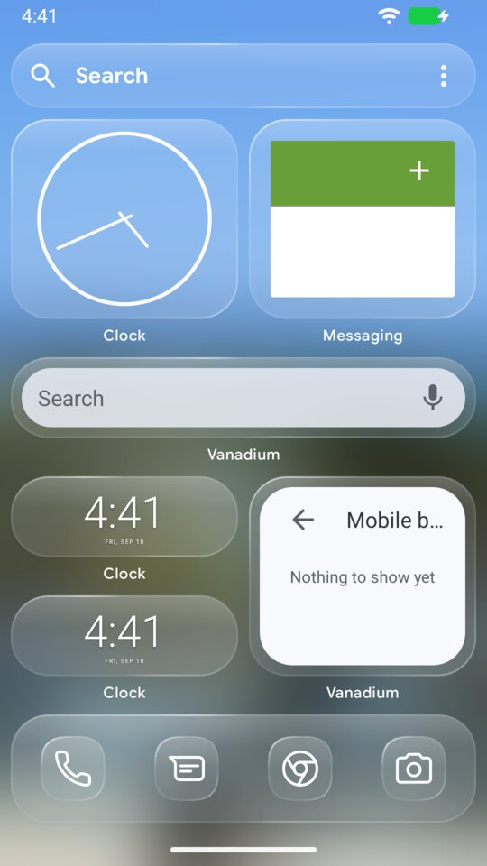
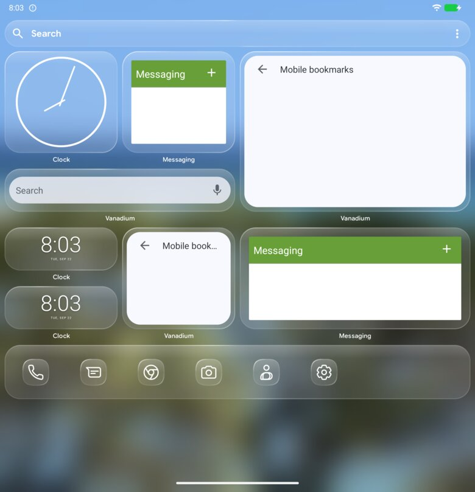

# Configuring Andashi Home

Andashi Home is configured by one JSON file, `launcher.json`. The file is the
source of truth: the launcher converges its state towards it on every reload,
and a change made on the device is written back into it
([ADR 0003](../architecture/adr/0003-config-hot-reload.md), and
[below](#changes-made-on-the-device)). Everything you can
set is on these pages, with pictures of what it does on a phone and on a Pixel
Fold (cover and inner display).




| Page | What it covers |
|---|---|
| [Appearance](appearance.md) | `appearance.glass` (the liquid-glass look), `appearance.wallpaper` |
| [Icons](icons.md) | `icons.themed`, `icons.enforceThemed`, `icons.pack`, the Clear look, Lawnicons |
| [Home grid](home-grid.md) | `home.grid`: columns, lock, labels, the phone and fold layouts, every item field, **where the dock can sit**, screens full of widgets |
| [Favorites](favorites.md) | `home.favorites`: the pinned apps the dock shows |
| [Search bar](search-bar.md) | `home.searchBar.position`, what search looks like |
| [Search](search.md) | `search`: favorites row, all apps, grid or list, labels, contacts, shortcuts, filter bar, keyboard, Enter, order, hidden items |
| [Screens](screens.md) | Every scene on the phone, the Fold's cover and its inner display |
| [Complete example](complete-example.json) | Every key the launcher applies, each off its default, in the form the read-back writes. The round-trip test runs it through parse, apply and read-back (#3) |

## The file

The top level has five keys: `schemaVersion` (required, currently `2`),
`icons`, `appearance`, `home` and `search`. Everything else is optional, and **an absent
key means "unmanaged", not "off"**: the launcher leaves whatever is set on the
device. Comments and trailing commas are allowed (JSONC).

The exceptions, in one place:
- a grid item's `borderless`, `background` and `themeColors` take their
  defaults when absent ([Home grid](home-grid.md)), and a write-back leaves
  them out again while they have their default;
- the wallpaper is not written back from the device: a wallpaper picked
  there has no upload name to write ([below](#changes-made-on-the-device));
- a grid item without geometry is placed by the launcher, and that
  placement is not written back; moving the item on the device is.

The smallest valid file:

<!-- config -->
```json
{ "schemaVersion": 2 }
```

A file that sets a little of everything:

<!-- config -->
```json
{
  // Bumped when the shape changes; older files are migrated.
  "schemaVersion": 2,
  "icons": { "themed": true },
  "appearance": {
    "glass": { "blur": 24, "tint": 0.12, "radius": 28, "contrast": "medium", "wallpaperBlur": true, "searchWallpaperBlur": true },
    "wallpaper": { "image": "zone.jpg", "target": "both" }
  },
  "home": {
    "searchBar": { "position": "top" },
    "favorites": ["com.android.dialer", "com.android.messaging", "app.vanadium.browser", "app.grapheneos.camera"],
    "widgets": { "enabled": true },
    "grid": {
      "columns": 4,
      "locked": false,
      "labels": true,
      "layouts": {
        "phone": {
          "items": [
            { "id": "clock", "widget": "com.android.deskclock/com.android.alarmclock.AnalogAppWidgetProvider", "x": 0, "y": 0, "w": 2, "h": 2 },
            { "id": "dock", "widget": "favorites", "x": 0, "y": 5, "w": 4, "h": 1 }
          ]
        }
      }
    }
  }
}
```

## Getting the file onto a device

Replace `<pkg>` with the launcher's package: `org.andashi.home` for a release,
`org.andashi.home.debug` for a debug build.

- **Push through the ingest provider** (works for every profile, including
  secondary users, from the unrooted shell):

  ```sh
  adb shell content write --uri content://<pkg>.config-ingest/launcher.json < launcher.json
  ```

  A wallpaper the file names is uploaded the same way, under its file name:

  ```sh
  adb shell content write --uri content://<pkg>.config-ingest/wallpapers/zone.jpg < zone.jpg
  ```

- **Or `adb push`** to `/storage/emulated/0/Android/data/<pkg>/files/config/launcher.json`
  (owner profile only).

The launcher watches the file and reloads on its own. To force a reload:

```sh
adb shell am broadcast -n <pkg>/de.mm20.launcher2.config.service.ReloadConfigReceiver -a <pkg>.action.RELOAD_CONFIG
```

## Reading back what applied

The launcher serves the effective configuration and the report of the last
reload. It always serves them in this file's shape, so a script can compare
field by field:

```sh
adb shell content query --uri content://<pkg>.state/config        # the effective document
adb shell content query --uri content://<pkg>.state/diagnostics   # the last reload report
```

The report lists `appliedMutations` (the sections that changed) and
`diagnostics`:

- **Errors** (`severity: error`): the file is not applied at all. Examples are
  malformed JSON, a value out of range (`invalid-glass`, `invalid-grid-geometry`,
  …) or an unknown enum value.
- **Warnings** still apply the file:
  - `unknown-key`: a misspelled or unknown key, which is ignored.
  - `inert-key`: a key this build accepts but does not act on, with the reason.
  - `permission-missing`: the file asks for something this profile does not
    hold the permission for (`search.contacts` without `READ_CONTACTS`). The
    key is kept and reads back as written, because the permission can be
    granted at any time; the warning says why it has no effect yet. It
    reflects the permission at the reload, so after a grant the next reload
    no longer carries it.
  - Grid corrections: an item was enlarged to the widget's minimum, shrunk to
    its maximum or the grid, nudged, or did not fit.
  - `write-back-skipped:<code>`: a change made on the device was kept there
    but not written into the file, and why (next section).

## Changes made on the device

A setting changed on the device, a favorite pinned, a search action edited
or a widget moved in edit mode is written back into `launcher.json`, so the
file keeps describing the device. Only keys the file already has are
written; a key it leaves out stays out, and the file never gains a section
it did not have. Everything else in the file, comments included, stays as
it was.

What the file says but the launcher could not do as written - a widget
height clamped to what the widget or the grid allows, a favorite whose app is not
installed - keeps its written value: write-back records what someone
changed, not what the launcher adjusted. It is one rule for both: a list
applied with some entries left out had an effect, the entries it wrote, and
that is what a later change on the device is compared with. The file keeps
the entry for the day the app arrives, as it keeps `h: 7` against a widget
that caps at 6.

A change stays on the device, and the report says why, when:
- `grid-unmanaged`: a widget was moved but the file has no
  `home.grid.layouts`; add `"layouts": {}` under `home.grid` to keep the
  arrangement in the file.
- `locked`: `home.grid.locked` is `true`, so the grid is not the device's to
  change.
- `no-baseline`, `not-applied-yet`: the launcher has not applied this exact
  file yet; the change is written after its next reload.
- `malformed-config`, `invalid-config`, `schema-version-outdated`: the file
  is broken, has errors, or is an older `schemaVersion`; it is never
  overwritten.

What is never written back is listed with the other exceptions under
[The file](#the-file).

## Removed keys

`appearance.transparency` (upstream's transparency schemes) was replaced by
`appearance.glass`. A file that still carries it gets one `inert-key` warning
and it has no effect. Schema version 1 files (with `home.dock`) are migrated on
load.

## How these pages are kept true

Every example marked for it is parsed by `ConfigurationDocsTest` and must
produce no diagnostic. The same test fails when a key of the contract is not
named on any page. The screenshots are taken by `e2e/config-screenshots.sh` on
the GrapheneOS emulator (a phone instance and a foldable one), from exactly the
configs shown, with provisioning's `themes/mauritius` wallpaper and Lawnicons
installed.
