# Appearance

`appearance` holds the look of the home screen: the glass surfaces, the
wallpaper and the theme. Design background: [ADR 0004](../architecture/adr/0004-liquid-glass-design.md).

## Glass

Every card, the dock, the search pill and every icon chip is a glass surface:
the blurred wallpaper under it, bent at the edge like a lens, a tint of the
zone's color, a light rim that is bright at the top-left, and a short
specular at the top edge.

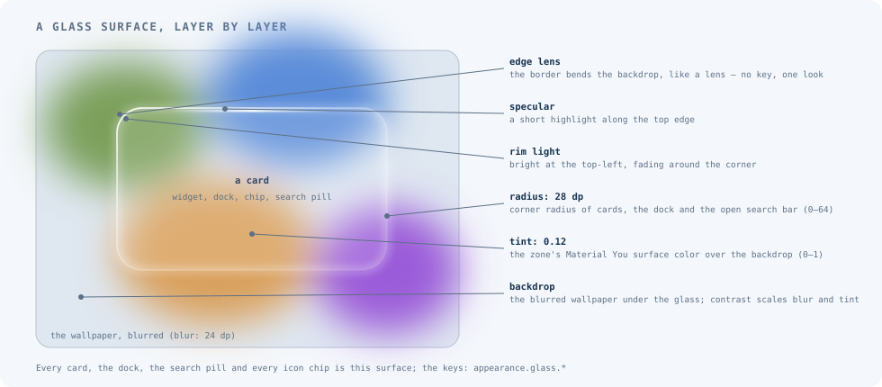

<!-- config -->
```json
{
  "schemaVersion": 2,
  "appearance": {
    "glass": { "blur": 24, "tint": 0.12, "radius": 28, "contrast": "medium", "wallpaperBlur": true, "searchWallpaperBlur": true }
  }
}
```

These are the defaults. Every key is optional; an absent one keeps what the
device has.

| Key | What it does | Accepted | Default |
|---|---|---|---|
| `appearance.glass.blur` | How soft the wallpaper behind glass is, in dp. `0` is tint only | 0–64 | 24 |
| `appearance.glass.tint` | How much of the zone's surface color lies over the backdrop | 0–1 | 0.12 |
| `appearance.glass.radius` | Corner radius of cards, the dock and the search bar while open, in dp | 0–64 | 28 |
| `appearance.glass.contrast` | `low`, `medium` or `high`. Scales blur and tint; `high` adds a dark scrim behind text and glyphs | enum | `medium` |
| `appearance.glass.wallpaperBlur` | The whole home background is the blurred wallpaper, not only what lies under glass | boolean | `true` |
| `appearance.glass.searchWallpaperBlur` | While search is open, the background behind it is the blurred wallpaper, whatever `wallpaperBlur` says | boolean | `true` |

A value out of range is an `invalid-glass` error and the file is not applied.
The glass needs a wallpaper the launcher manages (below). With a wallpaper set
by hand the surfaces are tint only.

### Contrast

`low` lowers the tint by 0.10 and the blur by a quarter. `high` raises the
tint by 0.15 and the blur by a quarter, and puts a 12 % black scrim behind
labels and glyphs.

<!-- config -->
```json
{ "schemaVersion": 2, "appearance": { "glass": { "contrast": "high" } } }
```

| `low` | `medium` | `high` |
|---|---|---|
| 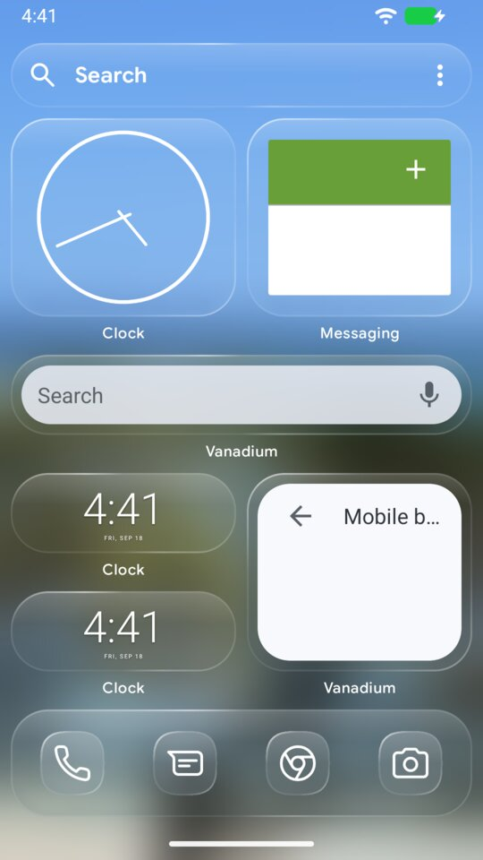 |  | 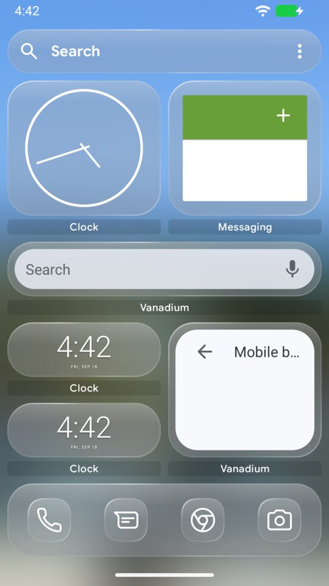 |

### Blur and the soft background

`appearance.glass.wallpaperBlur: false` keeps the wallpaper sharp and blurs
only what lies under glass. `appearance.glass.blur: 0` turns the blur off
altogether, which leaves the surfaces as tinted panes.

<!-- config -->
```json
{ "schemaVersion": 2, "appearance": { "glass": { "wallpaperBlur": false } } }
```

<!-- config -->
```json
{ "schemaVersion": 2, "appearance": { "glass": { "blur": 0, "wallpaperBlur": false } } }
```

| Default | `wallpaperBlur: false` | `blur: 0` |
|---|---|---|
|  | 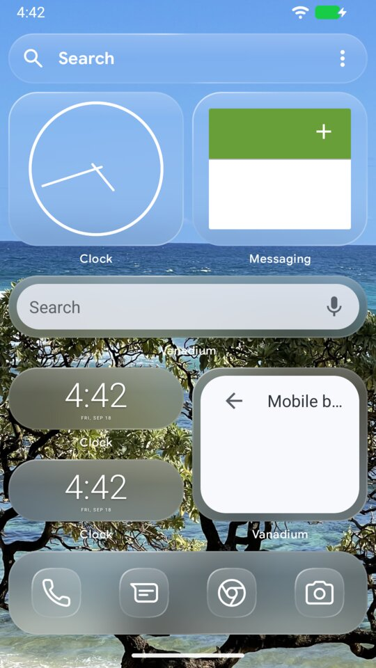 | 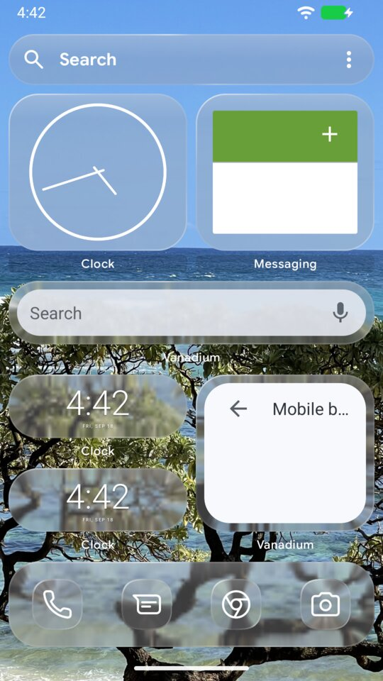 |

### Behind search

Search is an overlay, so it has its own setting. With the default
`searchWallpaperBlur: true` the wallpaper behind search is blurred even when
the home screen shows it sharp; opening search fades the blur in. `false`
shows the wallpaper behind search as the home screen does.

<!-- config -->
```json
{ "schemaVersion": 2, "appearance": { "glass": { "wallpaperBlur": false, "searchWallpaperBlur": true } } }
```

| | Phone | Fold, cover | Fold, inner |
|---|---|---|---|
| Home sharp, search blurred | 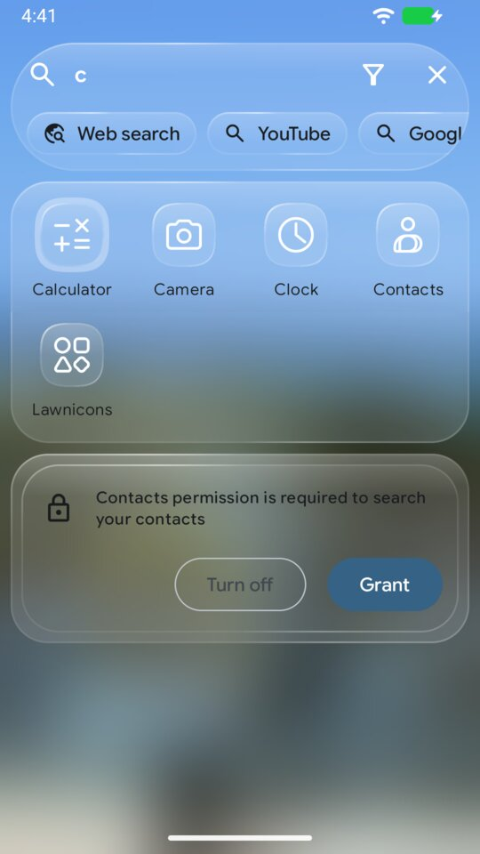 | 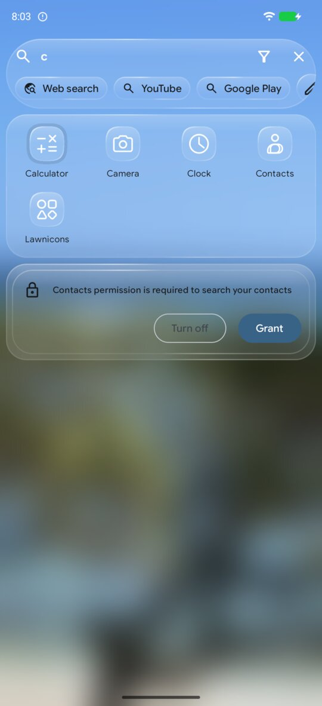 | 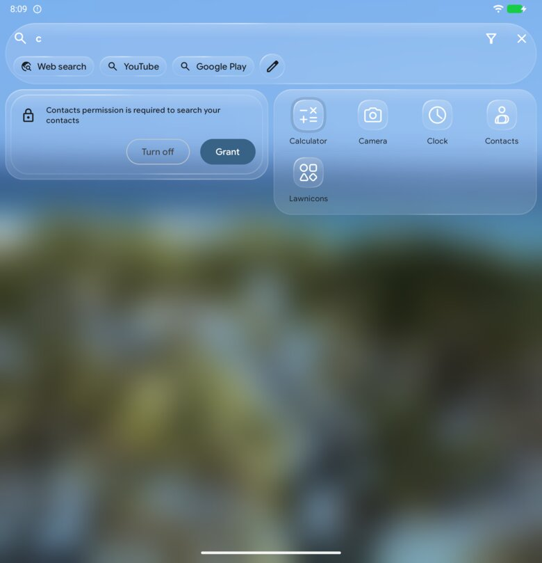 |
| `searchWallpaperBlur: false` | 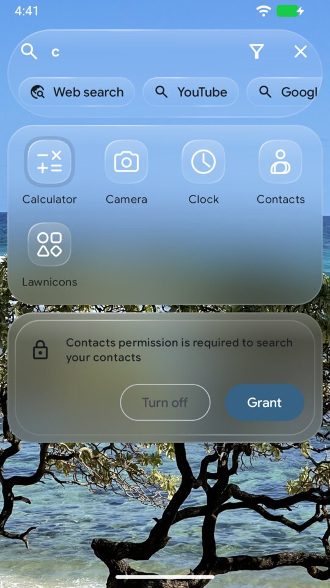 | 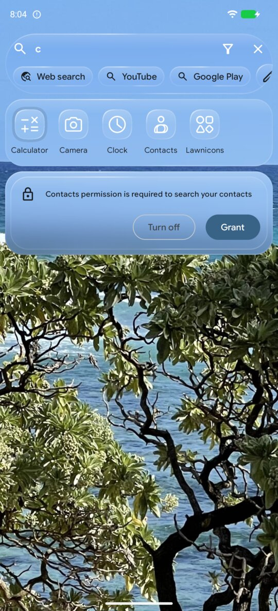 | 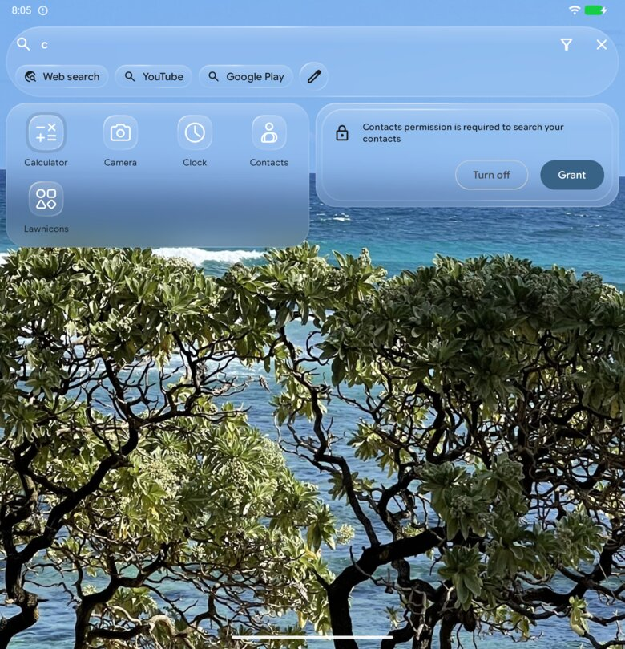 |

### Tint and radius

<!-- config -->
```json
{ "schemaVersion": 2, "appearance": { "glass": { "tint": 0.4, "radius": 8 } } }
```

| Default | `tint: 0.4` | `radius: 8` |
|---|---|---|
|  | 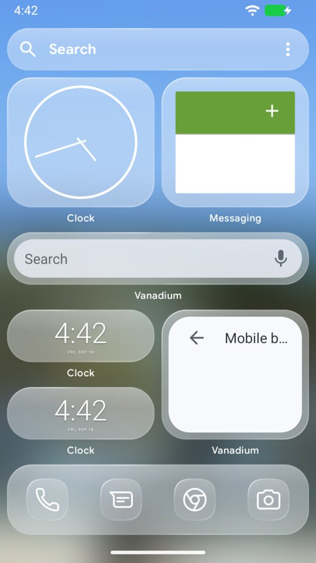 | 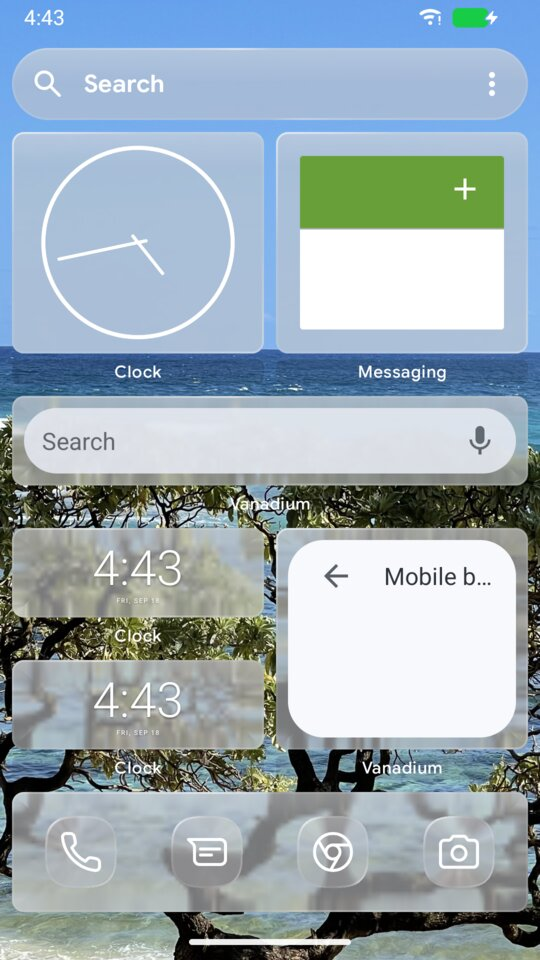 |

The tint uses the zone's Material You surface color, derived from the
wallpaper or the theme. The lens (how far the edge bends the backdrop) and the
rim have no key: there is one look.

## Wallpaper

<!-- config -->
```json
{
  "schemaVersion": 2,
  "appearance": { "wallpaper": { "image": "zone.jpg", "target": "both" } }
}
```

| Key | What it does | Accepted | Default |
|---|---|---|---|
| `appearance.wallpaper.image` | An image uploaded through the ingest provider (`content://<pkg>.config-ingest/wallpapers/<image>`) | a file name: letters, digits, `.`, `_`, `-`; no leading dot; up to 64 characters | — |
| `appearance.wallpaper.target` | `home`, `lock` or `both` | enum | `both` |

The launcher sets the wallpaper itself and remembers what it set. The
read-back names the image only while the device still shows it (not replaced
by hand, file unchanged). The system renders a wallpaper only for the profile
in front. A wallpaper configured for a background profile is therefore
recorded and set the next time that profile comes to the front; until then
the reload reports `wallpaper-pending-foreground`.

This managed wallpaper is also the only source of the glass backdrop. The
launcher cannot read a wallpaper set elsewhere without permissions it does not
ask for.

## Theme

`appearance.theme` picks light or dark and the colour scheme.

<!-- config -->
```json
{
  "schemaVersion": 2,
  "appearance": { "theme": { "mode": "system", "colors": "system" } }
}
```

These are the defaults. Every key is optional; an absent one keeps what the
device has.

| Key | What it does | Accepted | Default |
|---|---|---|---|
| `appearance.theme.mode` | `light`, `dark`, or `system` to follow the system's dark theme | enum | `system` |
| `appearance.theme.colors` | The launcher's built-in colour scheme: `system` follows the system palette, `black-and-white` and `high-contrast` replace it | enum | `system` |

`system` for `colors` is the zone's own palette: each zone gets its colour
from the system (its Monet seed), and the launcher follows it. A file names
one of the built-in schemes; it cannot define a palette. `black-and-white`
and `high-contrast` replace the zone's palette in the launcher's own
colours.

What each key changes on the glass look, measured on the fold's inner
display with search open (emulator, the system itself in light mode):

- `mode` turns the text white on `dark` and dark on `light`, and darkens the
  glass slightly (the search bar's mean brightness 219 on `light`, 206 on
  `dark`, out of 255).
- `colors` shows only in the text's tone: `black-and-white` is pure black
  where `system` is a tinted dark grey. The glass itself stays the same
  (219.4 against 219.9): it carries the scheme's surface colour only at the
  glass tint, 0.12 by default, and the wallpaper behind it dominates.

| 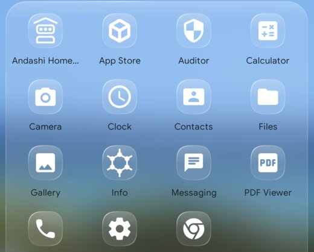 | 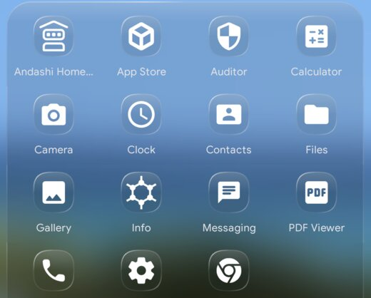 |
|---|---|
| `"mode": "light"` | `"mode": "dark"` |

On the device, a person can also pick a colour scheme they made themselves.
The file cannot name one, so write-back leaves `colors` as the file wrote it,
and the reload report carries a `write-back-skipped:colors-custom` warning
saying so.

## Removed: transparency

`appearance.transparency` was the upstream transparency scheme. It is
replaced by `appearance.glass`. A file that still has it gets an `inert-key`
warning and nothing changes.
