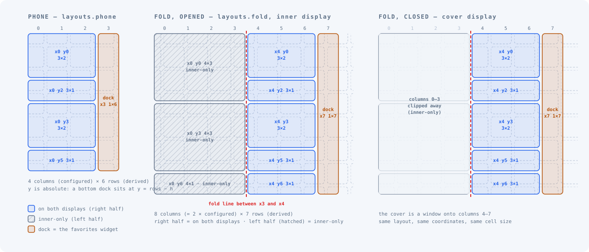
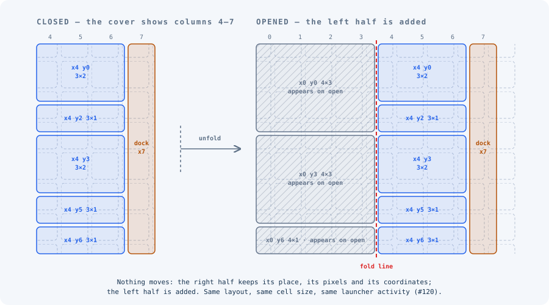
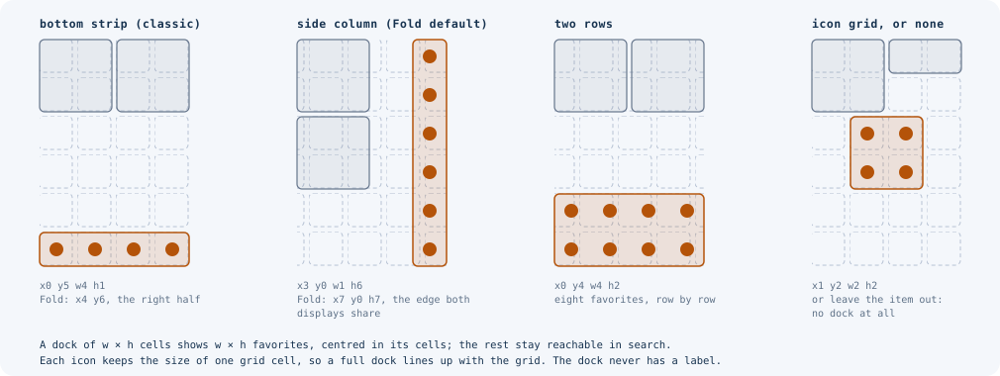

# Home grid

The home screen is one page: a grid of cells that holds widgets and the dock.
There are no app icons on it and no second page; everything else is one tap
away in search. Design background:
[ADR 0001](../architecture/adr/0001-single-page-widget-grid.md).

<!-- config -->
```json
{
  "schemaVersion": 2,
  "home": {
    "widgets": { "enabled": true },
    "grid": { "columns": 4, "locked": false, "labels": true }
  }
}
```

| Key | What it does | Accepted | Default |
|---|---|---|---|
| `home.widgets` | Holds the grid's master switch | object | — |
| `home.widgets.enabled` | Switches the grid on. Off, the home screen shows only the search bar | boolean | device setting |
| `home.grid.columns` | Columns of the grid on a phone and on the Fold's cover. The Fold's inner display has twice as many | 2–8 | 4 |
| `home.grid.locked` | No edit mode on the device, so the grid is never written back into the file | boolean | `false` |
| `home.grid.labels` | A label under every widget, never under the dock. It shows the app's name | boolean | `true` |
| `home.grid.layouts` | The layouts, one per form factor (below) | `phone`, `fold` | — |

Rows are not configured. The launcher derives them from the screen, so a cell
stays square: the phone instance these screenshots come from has 6 rows, the
Pixel Fold has 7 on both displays. `y` is absolute, so each layout puts its
bottom row (a bottom dock, say) at its own device's last row. A file pushed
before the launcher has drawn its grid is kept as written, since its rows are
not known yet. Once the grid is first measured, the layout is fitted and the
corrections are reported, with trigger `grid-measured` in the reload report.

| Labels on (default) | `labels: false` |
|---|---|
|  |  |

## Layouts: phone and fold

`home.grid.layouts` has up to two entries:
- `home.grid.layouts.phone`: used by phones.
- `home.grid.layouts.fold`: used by foldables. It is twice as wide (8
  columns with the default 4). The inner display shows all of it; **the cover
  shows columns 4 to 7 only**, the right half, where they are on the inner
  display: opening the device adds the left half, and what is on the cover
  stays where it was.



Opening the Fold moves nothing: the right half keeps its place, its pixels and
its coordinates, and the left half is added.



A device uses exactly one of them. A layout the file does not name is left as
it is on the device. `"items": []` is an empty screen, even when the config
arrives before the launcher was ever opened: a fresh launcher puts a default
dock on the grid only if no config has named a layout. A layout key other than `phone` or `fold` is reported
(`unknown-layout`) and ignored.

Each layout is `home.grid.layouts.<layout>.items`, a list of up to 32 items:

| Key | What it does | Accepted |
|---|---|---|
| `home.grid.layouts.<layout>.items[].id` | A stable name for the item; write-back and edit mode match on it | lowercase letters, digits, `-`; starts with a letter or digit; up to 32; unique in the layout |
| `home.grid.layouts.<layout>.items[].widget` | `favorites` for the dock, or a widget provider as `package/class` | |
| `home.grid.layouts.<layout>.items[].x` | Column of the top-left cell, from 0 | 0 to 64 |
| `home.grid.layouts.<layout>.items[].y` | Row of the top-left cell, from 0 | 0 to 64 |
| `home.grid.layouts.<layout>.items[].w` | Width in cells | 1 to 64 |
| `home.grid.layouts.<layout>.items[].h` | Height in cells | 1 to 64 |
| `home.grid.layouts.<layout>.items[].profile` | Which profile's widget: `personal`, `work`, `private` | enum, default `personal` |
| `home.grid.layouts.<layout>.items[].borderless` | Draw the widget without the card's padding | boolean, default `false` (see below) |
| `home.grid.layouts.<layout>.items[].background` | `false`: no glass surface behind the widget at all | boolean, default `true` (see below) |
| `home.grid.layouts.<layout>.items[].themeColors` | Hand the widget the zone's Material You colors | boolean, default `true` (see below) |

**An exception to "absent means unmanaged".** For `borderless`,
`background` and `themeColors`, and for these three keys only, an absent key
does not leave the device's value alone. It sets the default (`false`,
`true`, `true`) and keeps it, and the read-back serves the value either way.
So an item written without them and pushed again resets any change made to
them on the device. The item is stored whole; there is no "unset" for its
options. Measured by the round-trip test (#3, `ConfigRoundTripTest`).

**Geometry can be left out.** An item without `x`, `y`, `w`, `h` is
placed at the first free cells with the widget's default size. The
placement is the launcher's, not a change anyone made, so the file keeps the
item without geometry; once someone moves it on the device, write-back puts
its new geometry into the file. A position is `x` and `y` together; a lone
coordinate is ignored with a `partial-grid-position` warning. The launcher
keeps a layout valid on the actual screen:
- a size below the widget's minimum is enlarged (`widget-too-small`);
- a size above the widget's maximum, or larger than the grid, is shrunk
  (`widget-too-large`, which says which of the two set the limit). The
  read-back serves the shrunk size, because that is what is on screen, and
  the file keeps what it asked for: `h: 7` against a widget that allows 6
  reads back as 6 and stays 7 in the file (#140);
- an item across the Fold's middle is nudged (`grid-crosses-fold`);
- an item placed partly outside the grid is slid back in, and one that
  overlaps an earlier item is pushed down below it (`grid-item-moved`, which
  says where it went and why). Only an item the file gives an `x` and `y`
  is reported: one without is placed, and nothing was asked (#140);
- what does not fit is dropped (`grid-overflow`, `grid-out-of-bounds`).

Each correction is reported, and the file is still applied.

Widgets are named by their provider component. To find one, place it in edit
mode and read the file back, or run `adb shell dumpsys appwidget`.

## The dock

The dock is not a special bar. It is **the favorites widget on the grid**: an
item with `"widget": "favorites"`, moved and sized like any other. It shows the
apps from [`home.favorites`](favorites.md), filling its cells row by row, and
never has a label. Its shape is your choice:

| Where | Item |
|---|---|
| At the bottom, the traditional dock | `{ "id": "dock", "widget": "favorites", "x": 0, "y": 5, "w": 4, "h": 1 }` (a 6-row phone; `"x": 4, "y": 6` on the Fold, the right half both displays show) |
| A column on the side | `{ "id": "dock", "widget": "favorites", "x": 3, "y": 0, "w": 1, "h": 6 }` (`"x": 7, "h": 7` on the Fold, the right edge of both displays; the Fold's default) |
| Two rows | `{ "id": "dock", "widget": "favorites", "x": 0, "y": 4, "w": 4, "h": 2 }` |
| None | leave the item out |



Fewer favorites than cells are **centred**: each row's icons sit in its
middle, and the used rows sit in the middle of the dock's height. Three
favorites in a 4-wide dock are centred in the row; three in a 7-high column
are in the middle of the edge. Each icon keeps the size of one grid cell, so a
full dock lines up with the grid.

A dock of `w` × `h` cells shows `w × h` favorites. The rest stay reachable
through search, and edit mode shows how many do not fit.

### A screen full of widgets, the dock at the bottom

| Phone | Fold, cover | Fold, inner |
|---|---|---|
|  |  |  |

<!-- config -->
```json
{
  "schemaVersion": 2,
  "home": {
    "favorites": ["com.android.dialer", "com.android.messaging", "app.vanadium.browser", "app.grapheneos.camera", "com.android.contacts", "com.android.settings"],
    "grid": {
      "columns": 4,
      "labels": true,
      "layouts": {
        "phone": { "items": [
          { "id": "analog", "widget": "com.android.deskclock/com.android.alarmclock.AnalogAppWidgetProvider", "x": 0, "y": 0, "w": 2, "h": 2 },
          { "id": "messages", "widget": "com.android.messaging/com.android.messaging.widget.BugleWidgetProvider", "x": 2, "y": 0, "w": 2, "h": 2 },
          { "id": "search", "widget": "app.vanadium.browser/org.chromium.chrome.browser.searchwidget.SearchWidgetProvider", "x": 0, "y": 2, "w": 4, "h": 1 },
          { "id": "clock", "widget": "com.android.deskclock/com.android.alarmclock.DigitalAppWidgetProvider", "x": 0, "y": 3, "w": 2, "h": 1 },
          { "id": "bookmarks", "widget": "app.vanadium.browser/com.google.android.apps.chrome.appwidget.bookmarks.BookmarkThumbnailWidgetProvider", "x": 2, "y": 3, "w": 2, "h": 2 },
          { "id": "clock-2", "widget": "com.android.deskclock/com.android.alarmclock.DigitalAppWidgetProvider", "x": 0, "y": 4, "w": 2, "h": 1 },
          { "id": "dock", "widget": "favorites", "x": 0, "y": 5, "w": 4, "h": 1 }
        ] },
        "fold": { "items": [
          { "id": "analog", "widget": "com.android.deskclock/com.android.alarmclock.AnalogAppWidgetProvider", "x": 4, "y": 0, "w": 2, "h": 2 },
          { "id": "messages", "widget": "com.android.messaging/com.android.messaging.widget.BugleWidgetProvider", "x": 6, "y": 0, "w": 2, "h": 2 },
          { "id": "search", "widget": "app.vanadium.browser/org.chromium.chrome.browser.searchwidget.SearchWidgetProvider", "x": 4, "y": 2, "w": 4, "h": 1 },
          { "id": "clock", "widget": "com.android.deskclock/com.android.alarmclock.DigitalAppWidgetProvider", "x": 4, "y": 3, "w": 2, "h": 1 },
          { "id": "bookmarks", "widget": "app.vanadium.browser/com.google.android.apps.chrome.appwidget.bookmarks.BookmarkThumbnailWidgetProvider", "x": 6, "y": 3, "w": 2, "h": 2 },
          { "id": "clock-2", "widget": "com.android.deskclock/com.android.alarmclock.DigitalAppWidgetProvider", "x": 4, "y": 4, "w": 2, "h": 1 },
          { "id": "clock-3", "widget": "com.android.deskclock/com.android.alarmclock.DigitalAppWidgetProvider", "x": 4, "y": 5, "w": 2, "h": 1 },
          { "id": "clock-4", "widget": "com.android.deskclock/com.android.alarmclock.DigitalAppWidgetProvider", "x": 6, "y": 5, "w": 2, "h": 1 },
          { "id": "bookmarks-2", "widget": "app.vanadium.browser/com.google.android.apps.chrome.appwidget.bookmarks.BookmarkThumbnailWidgetProvider", "x": 0, "y": 0, "w": 4, "h": 3 },
          { "id": "messages-2", "widget": "com.android.messaging/com.android.messaging.widget.BugleWidgetProvider", "x": 0, "y": 3, "w": 4, "h": 2 },
          { "id": "search-2", "widget": "app.vanadium.browser/org.chromium.chrome.browser.searchwidget.SearchWidgetProvider", "x": 0, "y": 5, "w": 4, "h": 1 },
          { "id": "dock", "widget": "favorites", "x": 4, "y": 6, "w": 4, "h": 1 }
        ] }
      }
    }
  }
}
```

On the Fold the dock is the right half's four columns, so the cover and the
inner display show the same dock in the same place. An eight-wide dock is
possible too; the cover then shows its right half.

### A screen full of widgets, the dock on the side

| Phone | Fold, cover | Fold, inner |
|---|---|---|
|  |  |  |

<!-- config -->
```json
{
  "schemaVersion": 2,
  "home": {
    "favorites": ["com.android.dialer", "com.android.messaging", "app.vanadium.browser", "app.grapheneos.camera", "com.android.contacts", "com.android.settings"],
    "grid": {
      "columns": 4,
      "labels": true,
      "layouts": {
        "phone": { "items": [
          { "id": "analog", "widget": "com.android.deskclock/com.android.alarmclock.AnalogAppWidgetProvider", "x": 0, "y": 0, "w": 3, "h": 2 },
          { "id": "search", "widget": "app.vanadium.browser/org.chromium.chrome.browser.searchwidget.SearchWidgetProvider", "x": 0, "y": 2, "w": 3, "h": 1 },
          { "id": "messages", "widget": "com.android.messaging/com.android.messaging.widget.BugleWidgetProvider", "x": 0, "y": 3, "w": 3, "h": 2 },
          { "id": "clock", "widget": "com.android.deskclock/com.android.alarmclock.DigitalAppWidgetProvider", "x": 0, "y": 5, "w": 3, "h": 1 },
          { "id": "dock", "widget": "favorites", "x": 3, "y": 0, "w": 1, "h": 6 }
        ] },
        "fold": { "items": [
          { "id": "analog", "widget": "com.android.deskclock/com.android.alarmclock.AnalogAppWidgetProvider", "x": 4, "y": 0, "w": 3, "h": 2 },
          { "id": "search", "widget": "app.vanadium.browser/org.chromium.chrome.browser.searchwidget.SearchWidgetProvider", "x": 4, "y": 2, "w": 3, "h": 1 },
          { "id": "messages", "widget": "com.android.messaging/com.android.messaging.widget.BugleWidgetProvider", "x": 4, "y": 3, "w": 3, "h": 2 },
          { "id": "clock", "widget": "com.android.deskclock/com.android.alarmclock.DigitalAppWidgetProvider", "x": 4, "y": 5, "w": 3, "h": 1 },
          { "id": "clock-2", "widget": "com.android.deskclock/com.android.alarmclock.DigitalAppWidgetProvider", "x": 4, "y": 6, "w": 3, "h": 1 },
          { "id": "dock", "widget": "favorites", "x": 7, "y": 0, "w": 1, "h": 7 },
          { "id": "bookmarks", "widget": "app.vanadium.browser/com.google.android.apps.chrome.appwidget.bookmarks.BookmarkThumbnailWidgetProvider", "x": 0, "y": 0, "w": 4, "h": 3 },
          { "id": "messages-2", "widget": "com.android.messaging/com.android.messaging.widget.BugleWidgetProvider", "x": 0, "y": 3, "w": 4, "h": 3 },
          { "id": "search-2", "widget": "app.vanadium.browser/org.chromium.chrome.browser.searchwidget.SearchWidgetProvider", "x": 0, "y": 6, "w": 4, "h": 1 }
        ] }
      }
    }
  }
}
```

**On the Fold, a side dock that both displays show sits in column 7**: the
cover shows columns 4 to 7, so column 7 is the right edge of both displays and
the dock does not move when the device opens. This is the Fold's default dock.
A dock in column 3 would stand in the middle of the inner display and not be
on the cover at all.

## Editing on the device

A long press on an empty cell enters edit mode:
- drag an item to move it (the rest are pushed down);
- use the handles to resize it within the widget's limits;
- remove it, with undo;
- tap the dock to edit its favorites.

**Done** writes the layout back into `launcher.json`, so the file keeps
matching what you see. Pull it before pushing a changed file from elsewhere.
`home.grid.locked: true` disables all of this.
