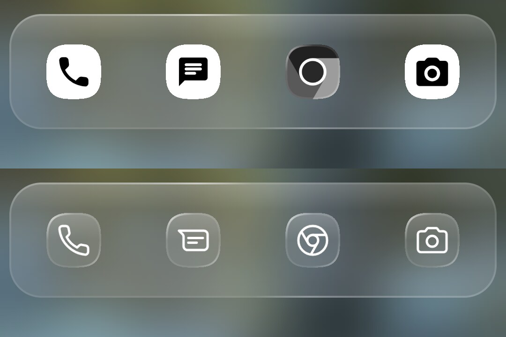

# Icons

On the home screen, in the dock and in search, every icon is drawn in the
**Clear** look. It is a glass chip on a squircle with the app's glyph on it in
white. When an app has no glyph, its original icon is drawn without color on
the same chip. A colored icon never appears. The settings screens keep normal
icons.

<!-- config -->
```json
{ "schemaVersion": 2, "icons": { "themed": true, "enforceThemed": false, "pack": "app.lawnchair.lawnicons" } }
```

| Key | What it does | Default |
|---|---|---|
| `icons.themed` | Use monochrome glyphs: the app's own monochrome layer or the icon pack's entry. Off: every icon is drawn without color | `true` |
| `icons.pack` | The package of an icon pack (ADW/Nova format) that supplies glyphs, or `"none"` for the apps' own icons | Lawnicons, when it is installed |
| `icons.enforceThemed` | Upstream's "force themed icons". In the Clear look an app without a glyph is drawn as its colorless original either way, so this changes nothing visible | `false` |
| `icons.size` | Icon size in dp in search, the dock and the pickers: `32`, `40`, `48`, `56` or `64`, the steps the settings offer. Any other value fails the file | `48` |
| `icons.adaptify` | Fit legacy icons (ones without an adaptive layer) into the adaptive shape. The Clear look shows an app's own icon only when it has no glyph, so this changes only those icons | `false` |
| `icons.badges.notifications` | A dot on an app that has notifications | `true` |
| `icons.badges.shortcuts` | The app's badge on the icon of one of its shortcuts | `true` |
| `icons.badges.suspendedApps` | A mark on an app that is paused | `true` |

`icons.badges` is an object of its own, and a key left out of it stays as it
is on the device. The read-back always serves all three.

There is no `icons.shape` key. Home, the dock and search always draw the
squircle (ADR 0004), so a shape key would change nothing there. The shape in
the settings only reaches the settings screens and some sheets.

## Lawnicons

With no `icons.pack` set, the launcher uses **Lawnicons** when it is
installed, and picks it up when it is installed later. Provisioning installs
it for every zone. Lawnicons covers every dock app the catalog uses. Without
it, some system apps' own monochrome layers are filled shapes and read as
white blocks.

`"pack": "none"` is how a file says "no pack": the apps' own icons, and no
Lawnicons either, even when it is installed. An absent `pack` does not mean
that; it leaves the choice to the device, which falls back to Lawnicons. The
same holds in the settings: choosing **System** there stores `none` (#3). The
read-back serves `none` as written and leaves an unset pack out.



Top: without a pack. Bottom: with Lawnicons.

Lawnicons is not bundled into the launcher. It is a separate app, 40 MB of
icons of other companies' logos, and it updates weekly.

## Themed icons off

<!-- config -->
```json
{ "schemaVersion": 2, "icons": { "themed": false } }
```

| Default | `themed: false` |
|---|---|
|  |  |

No glyph is used, so every icon is its colorless original. The Clear look
still never shows color.
