# Screens

Every scene of these docs on all three displays: a phone, the Pixel Fold closed (cover) and open (inner display). Each is the default configuration of the [full screen with the dock at the bottom](home-grid.md#a-screen-full-of-widgets-the-dock-at-the-bottom) plus the one setting named. The pictures come from `e2e/config-screenshots.sh` on the GrapheneOS emulator, with provisioning's Mauritius wallpaper and Lawnicons installed.

## A screen full of widgets, dock at the bottom

the defaults, `home.grid.labels: true`; see [home-grid](home-grid.md#a-screen-full-of-widgets-the-dock-at-the-bottom).

| Phone | Fold, cover | Fold, inner |
|---|---|---|
|  |  |  |

## A screen full of widgets, dock as a side column

dock item `x: 3, w: 1, h: 6`; see [home-grid](home-grid.md#a-screen-full-of-widgets-the-dock-on-the-side).

| Phone | Fold, cover | Fold, inner |
|---|---|---|
|  |  |  |

## Contrast low

`appearance.glass.contrast: "low"`; see [appearance](appearance.md#contrast).

| Phone | Fold, cover | Fold, inner |
|---|---|---|
|  | 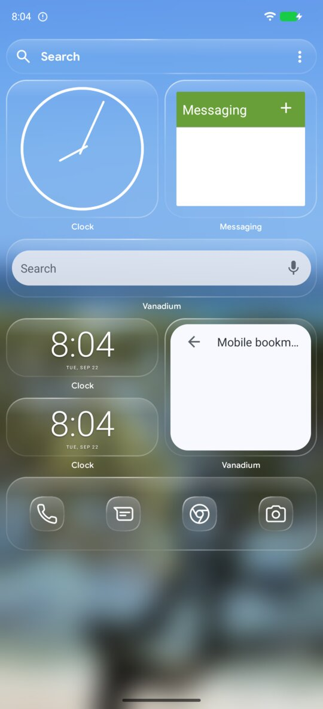 | 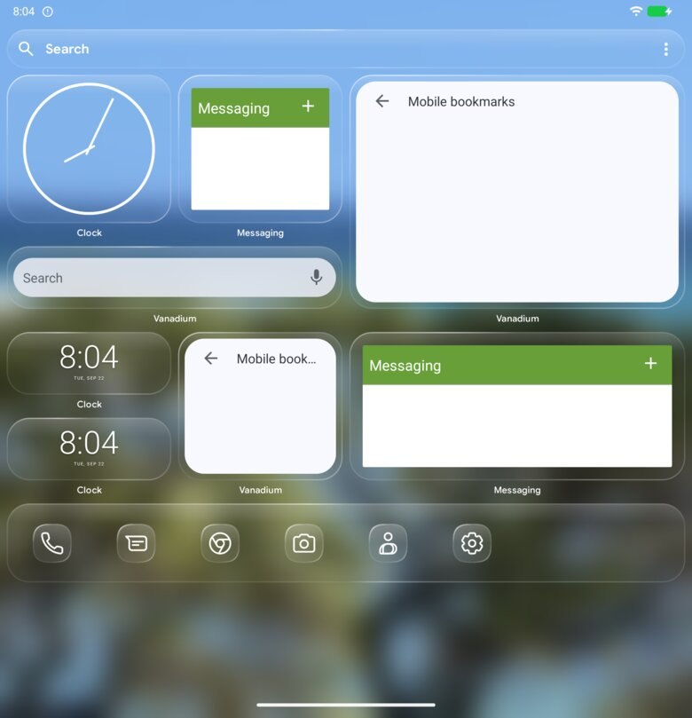 |

## Contrast high

`appearance.glass.contrast: "high"`; see [appearance](appearance.md#contrast).

| Phone | Fold, cover | Fold, inner |
|---|---|---|
|  | 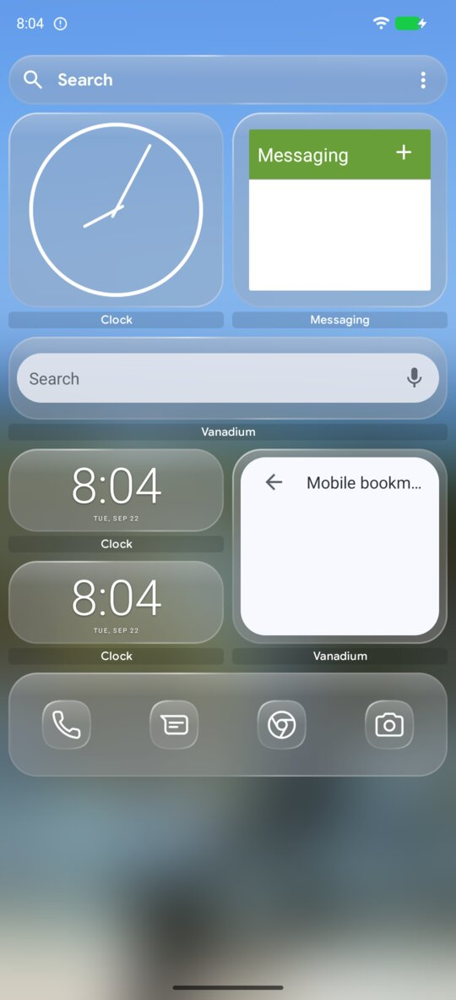 | 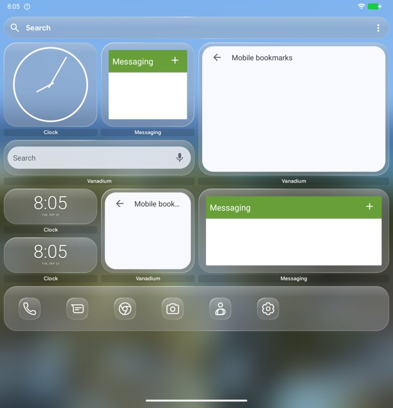 |

## No blur

`appearance.glass.blur: 0`, `wallpaperBlur: false`; see [appearance](appearance.md#blur-and-the-soft-background).

| Phone | Fold, cover | Fold, inner |
|---|---|---|
|  | 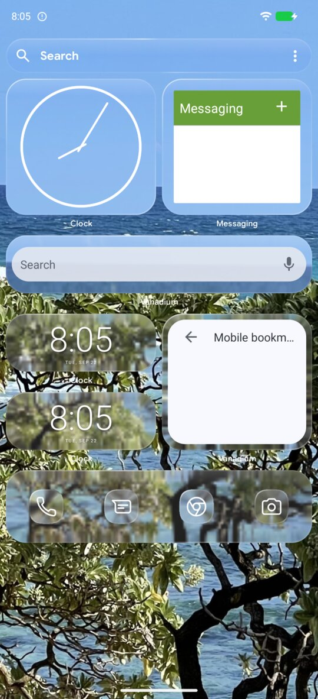 | 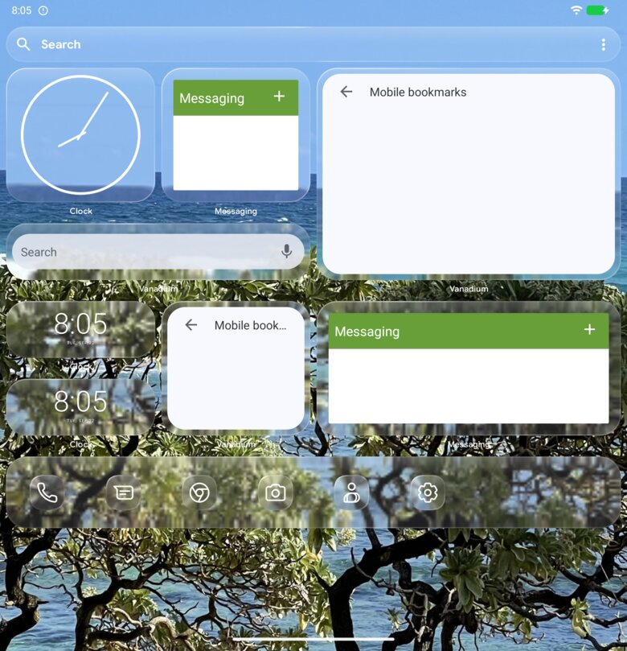 |

## Sharp wallpaper

`appearance.glass.wallpaperBlur: false`; see [appearance](appearance.md#blur-and-the-soft-background).

| Phone | Fold, cover | Fold, inner |
|---|---|---|
|  | 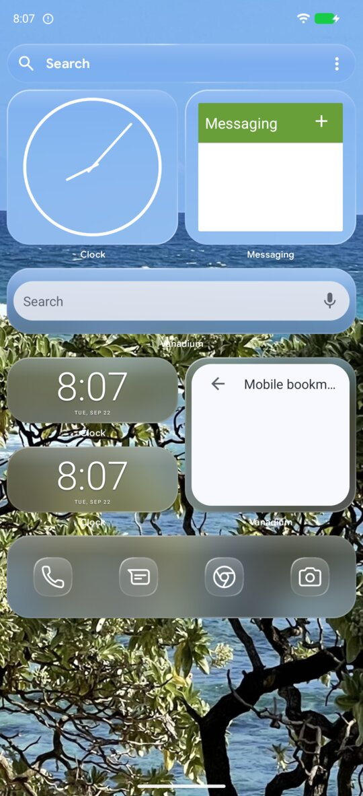 | 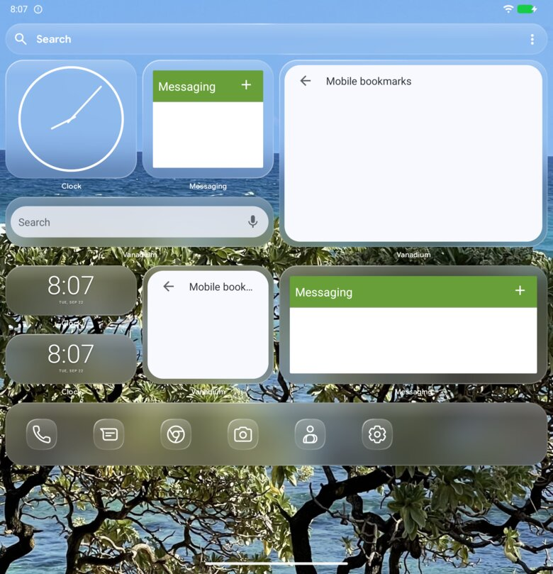 |

## Stronger tint

`appearance.glass.tint: 0.4`; see [appearance](appearance.md#tint-and-radius).

| Phone | Fold, cover | Fold, inner |
|---|---|---|
|  | 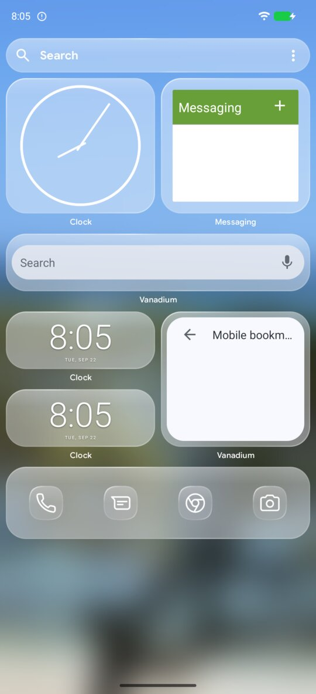 | 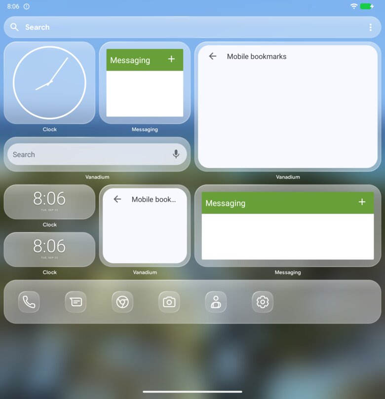 |

## Small radius

`appearance.glass.radius: 8`; see [appearance](appearance.md#tint-and-radius).

| Phone | Fold, cover | Fold, inner |
|---|---|---|
|  | 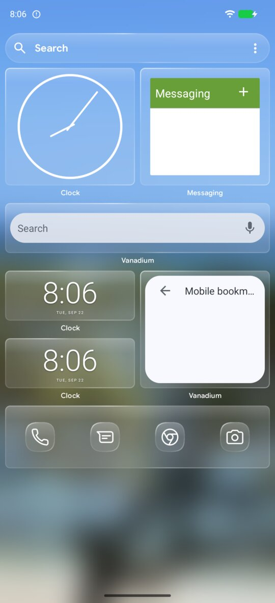 | 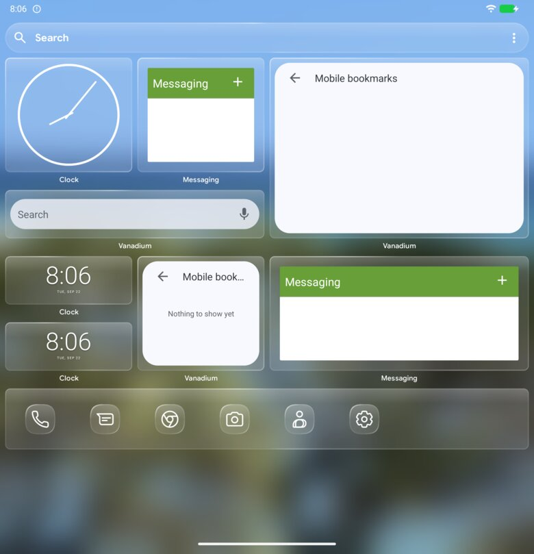 |

## Labels off

`home.grid.labels: false`; see [home-grid](home-grid.md).

| Phone | Fold, cover | Fold, inner |
|---|---|---|
|  | 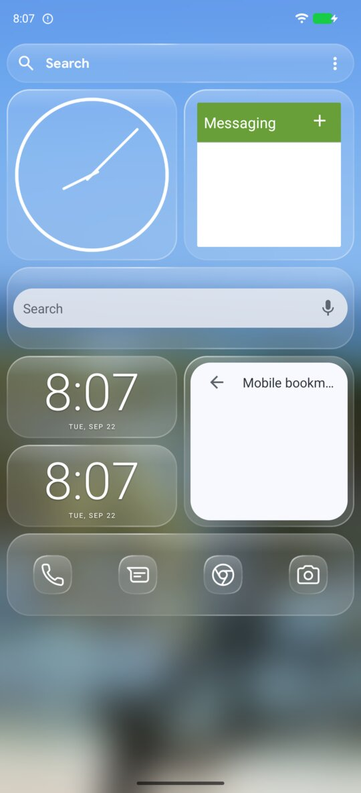 | 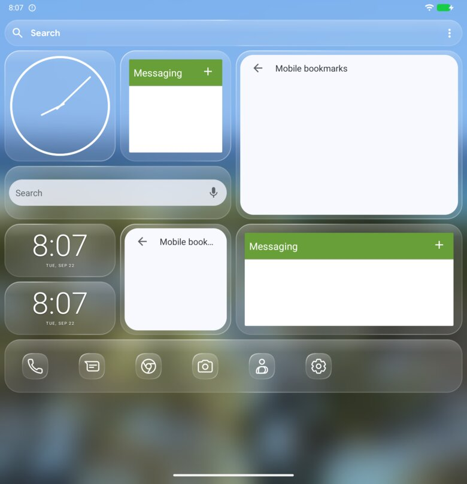 |

## Themed icons off

`icons.themed: false`; see [icons](icons.md#themed-icons-off).

| Phone | Fold, cover | Fold, inner |
|---|---|---|
| 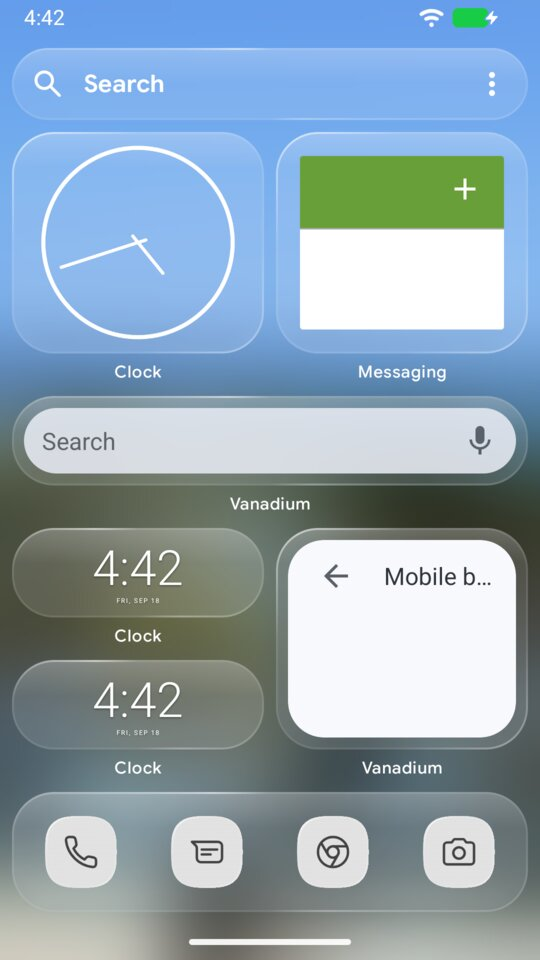 | 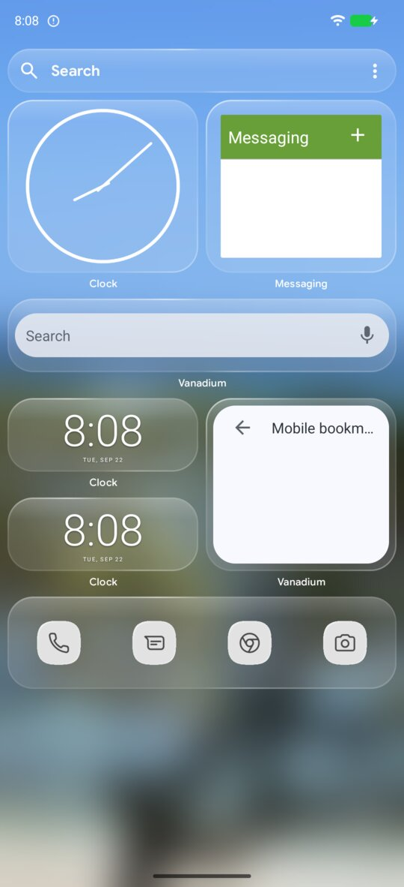 | 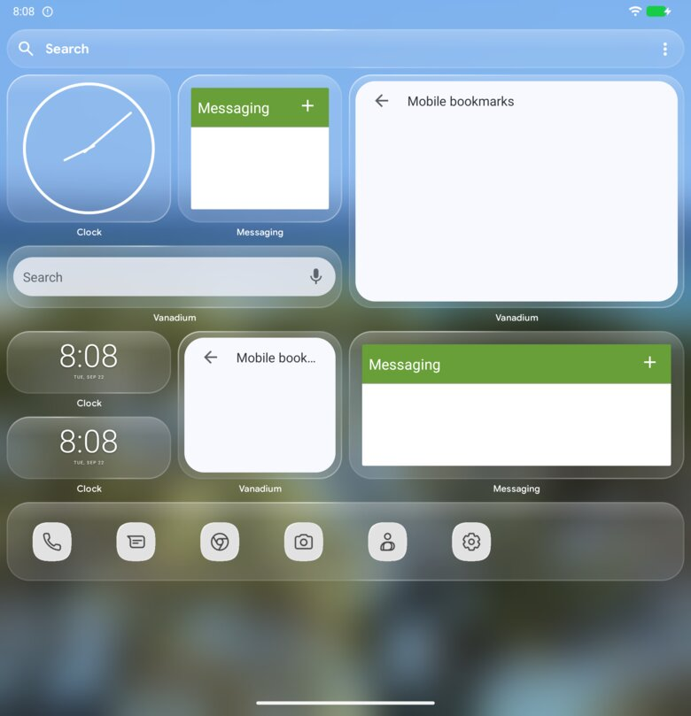 |

## Search bar at the bottom

`home.searchBar.position: "bottom"`; see [search-bar](search-bar.md).

| Phone | Fold, cover | Fold, inner |
|---|---|---|
|  | 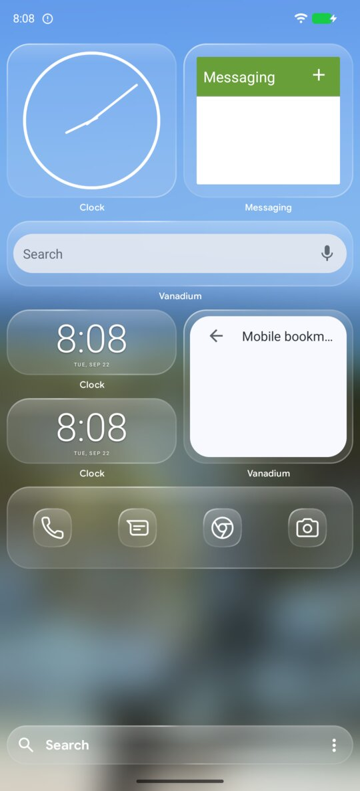 | 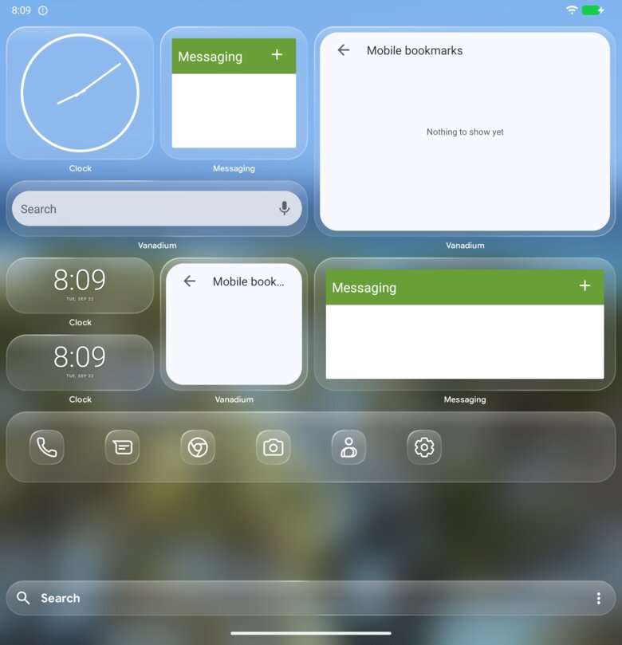 |
