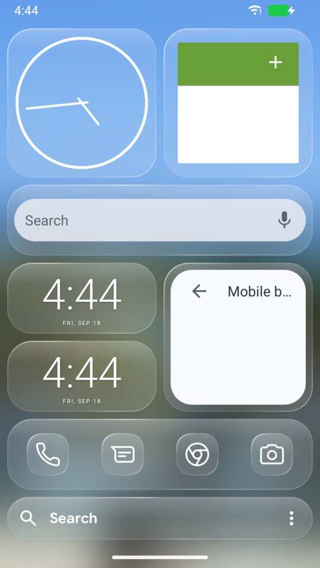
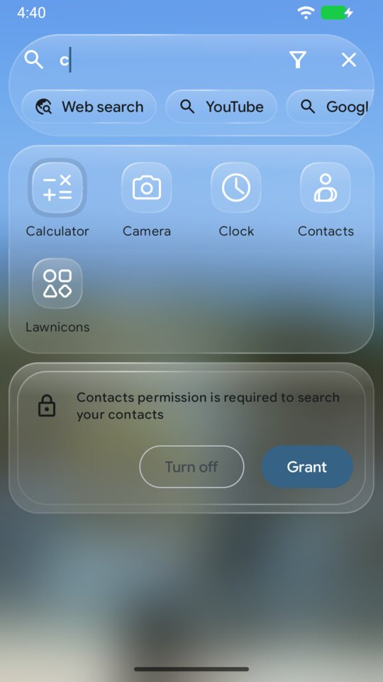
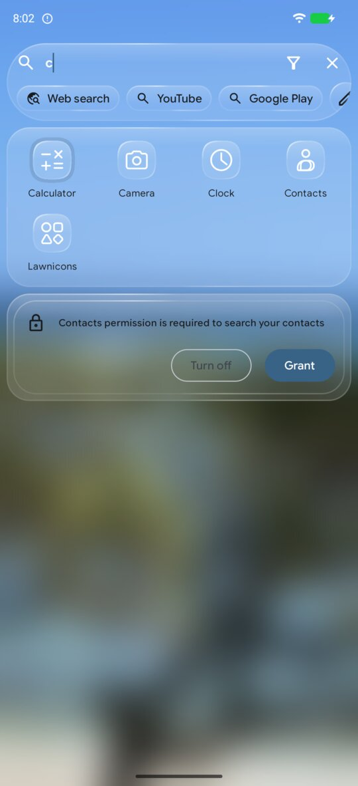
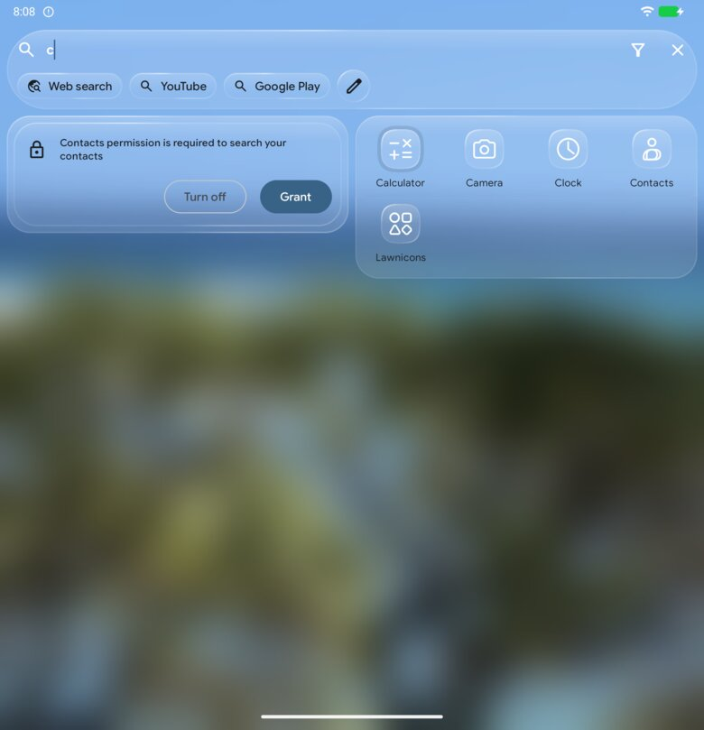

# Search bar

The search bar is a glass pill. Tapping it opens search: apps, app shortcuts
and contacts. It is configured under `home.searchBar`.

<!-- config -->
```json
{ "schemaVersion": 2, "home": { "searchBar": { "position": "bottom" } } }
```

| Key | What it does | Accepted | Default |
|---|---|---|---|
| `home.searchBar.position` | Where the pill sits | `top`, `bottom` | `top` |

| `top` | `bottom` |
|---|---|
|  |  |

## Search open

| Phone | Fold, cover | Fold, inner |
|---|---|---|
|  |  |  |

Search is drawn in the same glass as the home screen: the pill, every result
card, chip, menu, the keyboard's filter bar and the hidden-items sheet follow
`appearance.glass`, and every icon follows `icons`. The background behind
search has its own setting, `appearance.glass.searchWallpaperBlur` (see
[appearance](appearance.md#behind-search)).

Search lays out on the home grid: its app columns are `home.grid.columns`,
at the home grid's pitch and the dock's icon size, so an app in search sits
in the column it would have on the home screen. On the Fold's cover that is
the same `home.grid.columns` (four by default); on the inner display search has two panes that meet
at the fold line - favorites and apps in the half the cover shows, shortcuts,
contacts and the filters in the other - and nothing crosses the hinge.
