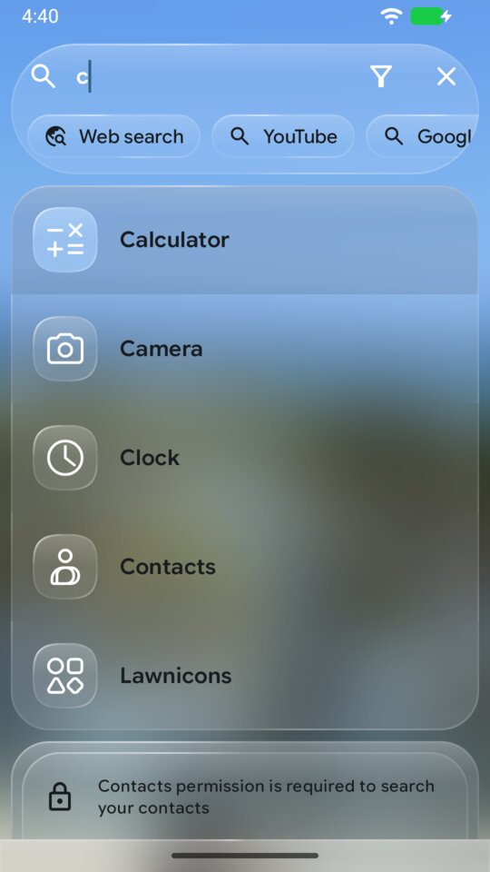
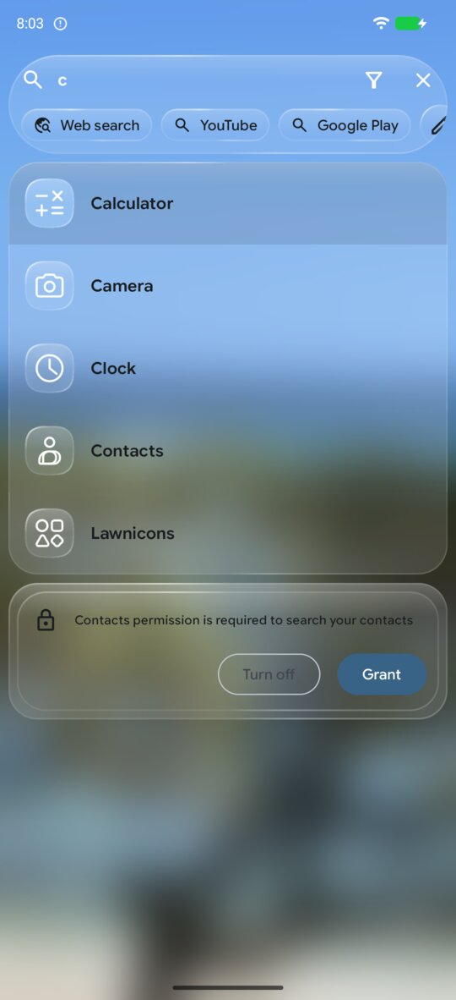
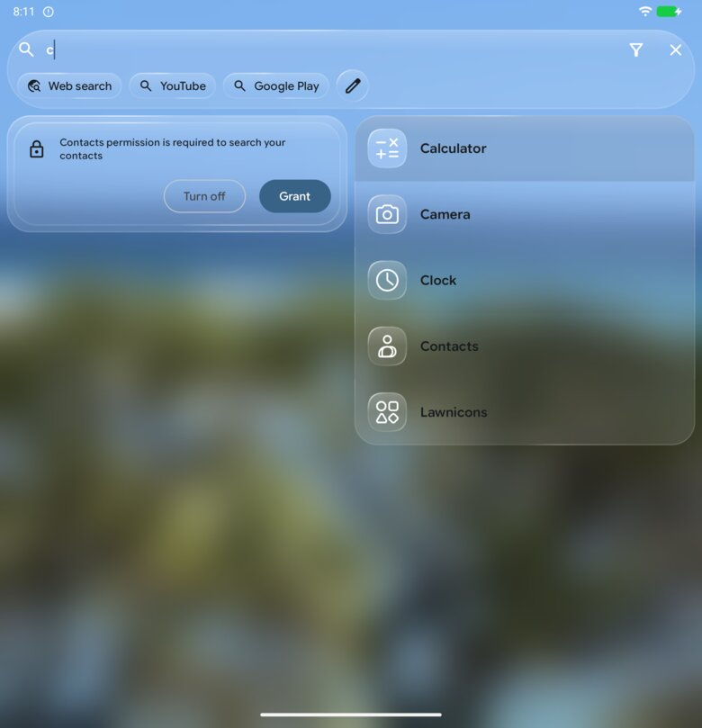
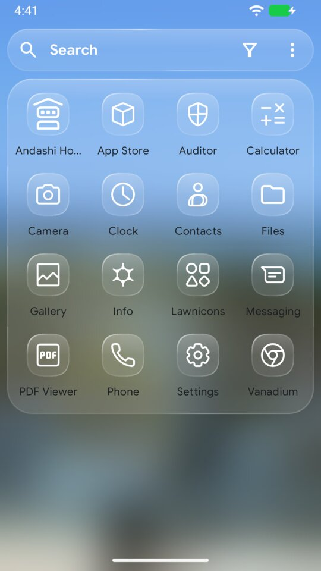
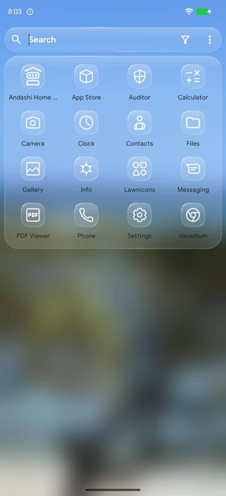
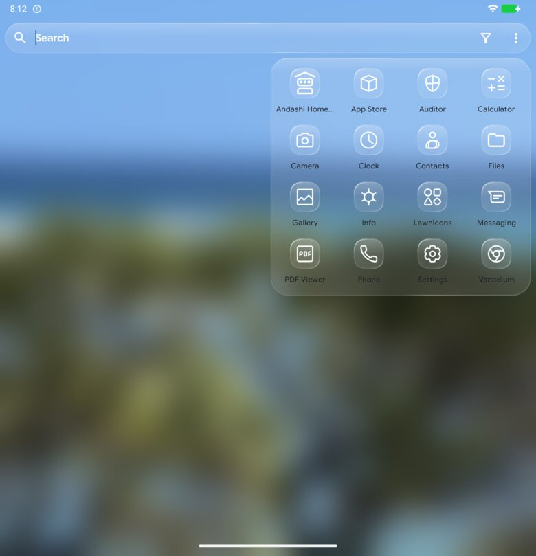

# Search

`search` is how search behaves. What it looks like comes from elsewhere:

- the glass from [`appearance.glass`](appearance.md), including the background
  behind search (`searchWallpaperBlur`);
- the app columns from [`home.grid.columns`](home-grid.md);
- the position of the bar from [`home.searchBar`](search-bar.md).

<!-- config -->
```json
{
  "schemaVersion": 2,
  "search": {
    "favorites": true,
    "allApps": true,
    "layout": "grid",
    "labels": true,
    "contacts": true,
    "shortcuts": true,
    "filterBar": true,
    "openKeyboard": true,
    "launchOnEnter": true,
    "reversed": false,
    "hiddenItemsButton": false
  }
}
```

| Key | What it does | Accepted | Default |
|---|---|---|---|
| `search.favorites` | The favorites row at the top of search, with its tag chips. While nothing is pinned or used often (and no tag is pinned), the row is not shown either way | boolean | `true` |
| `search.allApps` | All apps while the query is empty; off, an empty query shows only favorites | boolean | `true` |
| `search.layout` | App results as icons in the home grid's columns, or as a list | `grid`, `list` | `grid` |
| `search.labels` | Labels under app icons in search (the dock never has labels) | boolean | `true` |
| `search.contacts` | Contacts in the results. It grants no permission: without it, search shows a banner that asks | boolean | `true` |
| `search.shortcuts` | App shortcuts in the results | boolean | `true` |
| `search.filterBar` | The filter bar above the keyboard (apps, shortcuts, contacts) | boolean | `true` |
| `search.openKeyboard` | The keyboard opens when search opens | boolean | `true` |
| `search.launchOnEnter` | Enter on the keyboard launches the best match | boolean | `true` |
| `search.reversed` | Results from the bottom up, the best match nearest a bottom search bar | boolean | `false` |
| `search.hiddenItemsButton` | A button in the search bar that shows hidden items | boolean | `false` |

The defaults are the launcher's behavior before this section existed, so a
file without `search` changes nothing. A key that is left out stays as it is
on the device. The read-back always serves every key.

## A list instead of icons

<!-- config -->
```json
{ "schemaVersion": 2, "search": { "layout": "list" } }
```

| Phone | Fold, cover | Fold, inner |
|---|---|---|
|  |  |  |

## Without the favorites row

<!-- config -->
```json
{ "schemaVersion": 2, "search": { "favorites": false } }
```

| Phone | Fold, cover | Fold, inner |
|---|---|---|
|  |  |  |

The favorites row shows while the query is empty, so these pictures are of
search opened without typing.

`search.favorites: false` turns the row off for good. With it on, a zone where
nothing is pinned, nothing is used often yet and no tag is pinned also shows no
row, so search starts with the apps; the row appears with the first favorite.

## On the Fold

On the cover, search uses the home grid's four columns. On the inner display
it has two panes that meet at the fold line: favorites and apps in the half
the cover shows, at the home grid's pitch, and shortcuts, contacts and the
filters in the other half. Nothing crosses the hinge.
